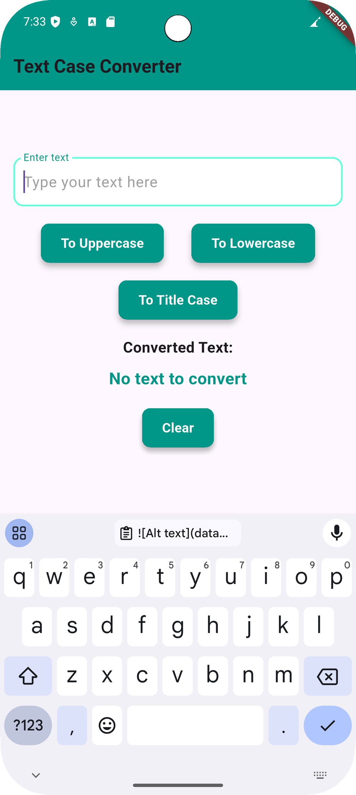

# Lab 1
## Text Case Converter

### Overview
The **Text Case Converter** is a Flutter application that allows users to convert input text into different case formats, including:
- Uppercase
- Lowercase
- Title Case

Users can enter text into the input field and use buttons to transform the text accordingly. A "Clear" button is also provided to reset the input field and converted text.

### Features
- Convert text to **Uppercase**.
- Convert text to **Lowercase**.
- Convert text to **Title Case**.
- Clear input and output text.

### Usage
1. Enter text in the text field.
2. Click the respective button to convert the text:
    - "To Uppercase" → Converts text to uppercase.
    - "To Lowercase" → Converts text to lowercase.
    - "To Title Case" → Converts text to title case.
3. The converted text is displayed below.
4. Click "Clear" to reset the input and output.

### Example

